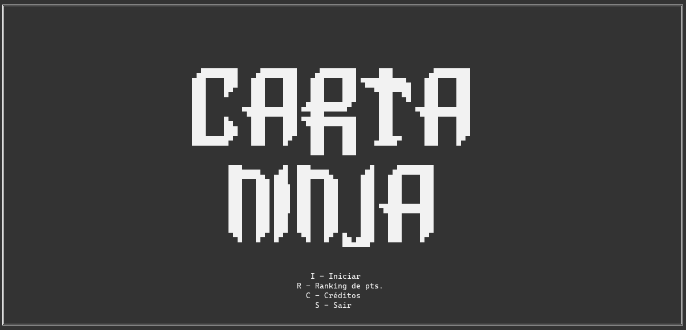
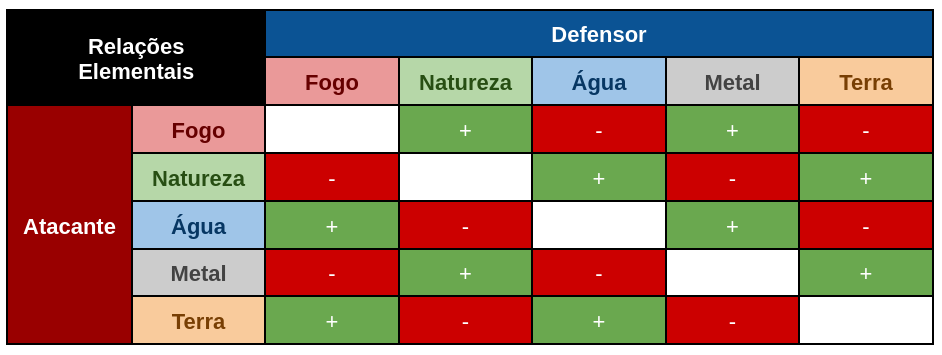

# Carta Ninja

<div style="width: 100%; display: flex; justify-content: center; margin-bottom: 32px">
  
</div>

Repositório destinado ao projeto da disciplina de PLP.

## Conteúdo

- [Descrição](#descrição)
- [Como instalar e jogar?](#como-instalar-e-jogar)
- [Regras do Jogo](#regras-do-jogo)
- [Equipe](#equipe)

## Descrição

Carta Ninja é um jogo de cartas com uma temática de ninjas e samurais. O jogador
pode utilizar cartas de diferentes elementos em batalhas contra a máquina. 
Essas batalhas têm como principal objetivo incrementar o nível de faixa do 
jogador, que inicia no nível de faixa branca, mas pode subir de nível 
gradativamente ao vencer mais e mais batalhas, até alcançar o nível de faixa 
preta.

## Como instalar e jogar?

Para jogar Carta Ninja, você precisa ter o `GHC` e o `Cabal` instalado em sua 
máquina. Caso ainda não possua esses pacotes instalados, recomendamos a instalação
via [GHCup](https://www.haskell.org/ghcup/install/).

Tendo essas dependências instaladas, clone o repositório com o comando abaixo:
```
git clone https://github.com/Samurai-Turtles/Carta-Ninja.git
```

Na pasta em que você clonou o projeto, abra seu terminal e execute `cabal run`.
Se tudo der certo, você deve ver a seguinte tela:



## Regras do Jogo

O jogo funciona no sistema de campanhas (Runs), onde o jogador irá travar
uma série de batalhas contra o Bot para elevar sua faixa. Cada faixa terá um
grau de dificuldade e um chefe que o jogador deve vencer.

As campanhas também tem um sistema de vidas. Quando o jogador perder uma 
batalha, seu total de vidas é decrementado em 1. A campanha terminará quando
o jogador vencer todos os chefes ou quando perder todas as suas vidas.

Durante uma batalha, ambos jogador e Bot recebem as mesmas 15 cartas, em ordens
diferentes. Para vencer seu adversário, você deve jogar uma carta que tenha um
**valor de poder maior** ou um **elemento que seja dominante** sobre a carta do 
oponente. Abaixo está a tabela de elementos das cartas e sua dominância sobre
outros elementos:



A batalha acaba quando pelo menos uma das três condições abaixo for alcançada:
- Um jogador obtiver **três vitórias seguidas** na partida
- Um jogador obtiver **uma vitória com uma carta de cada elemento**
- Se nenhuma das condições acima for alcançada ao final dos 10 rounds, **ganha aquele que obteve mais pontos durante a partida**
  - Se houver empate nos pontos, **a partida será repetida sem perda de vidas** para
    o jogador

## Equipe

- [Leandro de Oliveira](https://github.com/losout0)
- [Lucas Khalil](https://github.com/LucasKhalil)
- [José Willian](https://github.com/JWillianSl)
- [Sérgio Gustavo](https://github.com/sergio-gustavo-andrade-grilo)
- [Vinicius Ataíde](https://github.com/UltraNX)
- [Douglas Domingos](https://github.com/dougdomingos)

